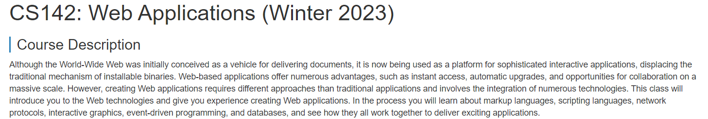

# CS142-Web-Development

## Introduction

This repo is for <a href="http://web.stanford.edu/class/cs142/index.html">CS142</a>

## Progress

- <a href="https://github.com/ascendho/CS142-Web-Development/tree/master/Project1%EF%BC%9AHTML%20and%20CSS">Project1: HTML and CSS</a>
- <a href="https://github.com/ascendho/CS142-Web-Development/tree/master/Project2%EF%BC%9AJavaScript%20Calisthenics">Project2: JavaScript Calisthenics</a>

## LICENSE

- This repo is under MIT License
- For any materials involved in this repo, if you feel you have been infringed, please just [email](mailto:ascendho@outlook.com) me